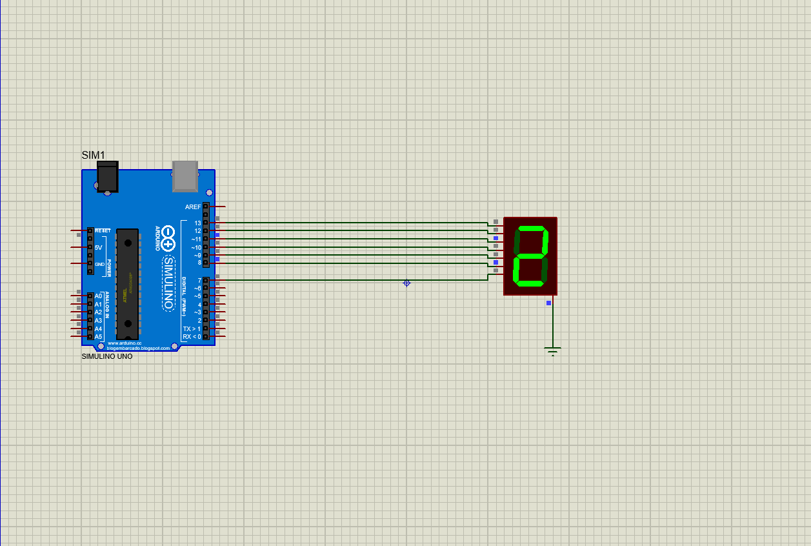
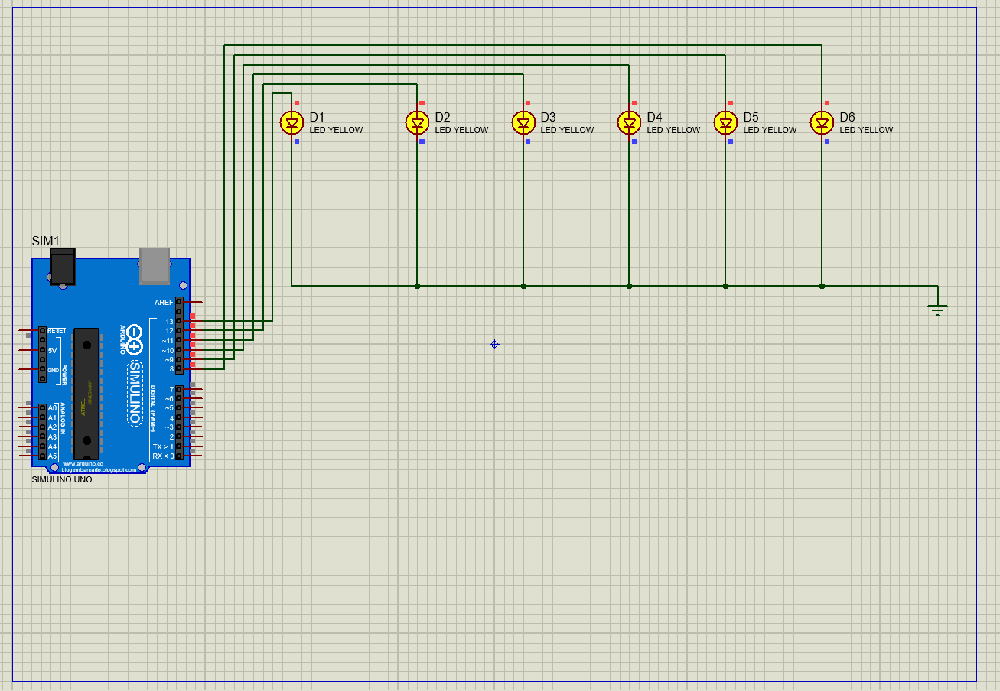

# 7-segment-display_and_LED-lights
(1) count digit 7-segment display.
(2) control led light (using arduino and proteus).

### (1) counting digit:
proteus-software: a) arduino uno device 
                  b) 7-segment display device
                  c) ground

### (1) control led light:
proteus-software: a) arduino uno device 
                  b) led lights
                  c) ground

